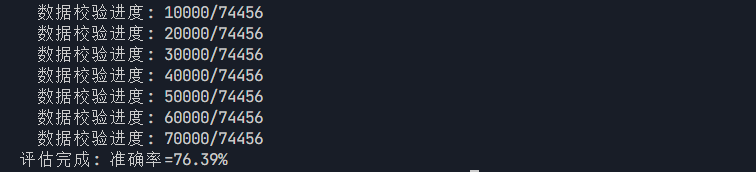
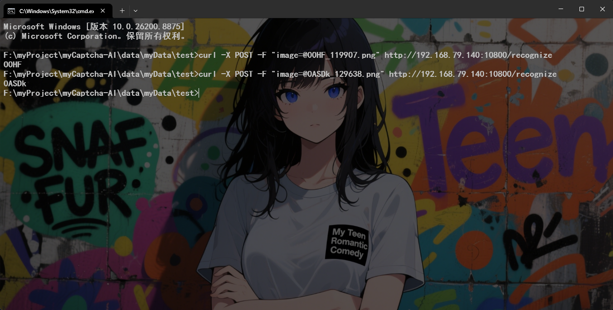

# myCaptcha-AI

## 1.项目介绍

**目标是训练一个能识别各种类型且具有高识别率的图形验证码AI模型**


**项目的架构：** 采用分层ai的架构，简单描述为 **"路由ai+功能ai"**，其中使用flask框架对外提供服务api，同时对内对各种功能ai的启动进行调度管理

**为什么要使用这种架构？**
1. 这种架构容易进行新识别类型功能的拓展（对于这个小项目来说），同时也便于维护
2. 众所周知，神经网络隐藏层的**黑盒特性**，导致了很难通过调整网络结构和优化参数来提供模型各种类型的识别率（个人能力精力有限）
3. 对于一张**确定类型**的图形验证码可以减少性能消耗，，指定启动某个ai来处理（不需要路由ai）进而可以减少性能消耗；对于一张**不确定类型**的图形验证码其性能消耗不一定有优势，因为 路由ai+功能ai 的处理性能 与 端到端的各种识别功能ai 的处理性能 取决于对自身模型优化，那种模型优化好性能就好

使用flask对外提供api，就可以增大这个项目的可用性场景，因为在很多开源项目比如一些插件什么的，都可以调用这个项目的api来实现验证码识别功能

---

## 2.路由ai

目前先使用 CNN 网络结构，速度快且性能消耗小

---

## 3.功能ai

1. **数字+字母混合验证码：** 使用 CRNN+CTC 的神经网络结构 

2. **计算式验证码：** 使用 CRNN+CTC 的神经网络结构 

3. **语言验证码（如中文汉字）：** 使用 CRNN+CTC 的神经网络结构 

**三类验证码均采用 CRNN+CTC 架构。选择这套方案的理由比较直接：**

首先，CNN 负责从图像里提取视觉特征，这是后续所有判断的基础。接着，RNN（实际使用的是双向LSTM）会利用这些特征做序列建模，核心作用是结合上下文来区分容易混淆的字符——比如单独看一个点可能是`0`也可能是`O`，但在数字字母验证码里结合前后的字符信息，RNN能判断得更准。最后，CTC 层解决的是对齐问题：输入的图片宽度和输出的字符长度不是一一对应的，CTC允许模型跳过无关区域、压缩重复信息，直接把不等长的特征序列映射成最终文本串。

这三层加在一起，最大的好处是省掉了传统方法里最麻烦的一步——字符切割。对于有粘连、扭曲或长度不固定的验证码，手动切字符本身就不现实。CRNN+CTC 走端到端路线，输入图片直接出字符串，在实际·场景的验证效果理论上应是稳定的，也符合我们这个项目对扩展性和维护性的要求。


---

## 4.部署


在部署之前，需要下载模型权重文件到本地`src/Digital-Letters-OCR/`目录下。

1. 使用docker部署
```bash
docker compose up -d  # 默认是cpu模式
docker compose up -d --gpus all  # 使用gpu模式
```

1. python依赖启动
```bash
pip install -r requirements.txt
python app.py  # 启动服务api
```


---


## 5.问题与解决思路

### 5.1 模型泛化


验证码的难点在于同一类型也会有字体、倾斜、噪点、模糊程度等各种差异，如果只是死记硬背训练数据，换个画风就崩了。为此我做了几层防护：数据增强方面，训练时对每张图片随机做水平缩放抖动（±5%）、随机旋转（±5°）、高斯模糊（20% 概率）和高斯噪声（±0.05），这些增强随机组合，每个 epoch 模型看到的图都不一样，逼着它去学真正的字符特征而不是记住特定像素；模型结构方面，在 CNN 输出之后和两层 LSTM 之间各加了 40% 的 Dropout 随机失活，训练时每次 forward 都随机关掉一部分神经元，模型就不能偷懒依赖个别强特征，推理时全部保留相当于多个子模型的集成效果；训练策略方面，L2 权重衰减（1e-4）惩罚过大的权重让模型更平滑，梯度裁剪（max_norm=5）防止异常样本导致梯度爆炸，每隔 2 个 epoch 验证一次，准确率连续 6 次没提升就早停，同时配合 ReduceLROnPlateau 在平台期自动减半学习率，防止模型在训练集上刷分但验证集往下掉。这三层从数据、结构、策略三个维度同时下手，模型的泛化能力有所提升（起码可用），但是准确率又下降了，有得有失。


---


## Digital-Letters-OCR

模型：src/Digital-Letters-OCR/


可以识别以下类似的图形验证码：

<table>
  <tr>
    <td></td>
    <td></td>
    <td></td>
    <td></td>
    <td></td>
  </tr>
</table>

目前模型准确率：76.39%

<div align="center">
  
</div>


部署后的服务api接口：**10800/recognize** ，返回结果为txt格式

<div align="center">
  
</div>


---

